# 1. Flow map

## cookies policy page

* 3 buttons, "Paramétrer", "Tout accepter", "Continuer sans accepter"
* Cookies informations text

## title choice / connexion page
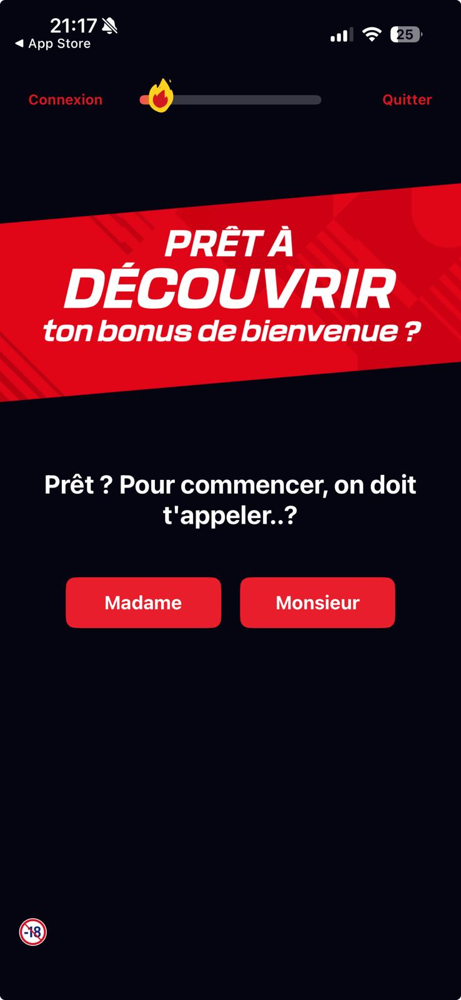
* 4 buttons, "Connexion", "Quitter", "Madame", "Monsieur"
* a progression bar
* a bonus banner "PRET A DECOUVRIR ton bonus de bienvenue"
* a starting text "Prêt ? Pour commencer, on doit t'appeler..?"

## FirstName page
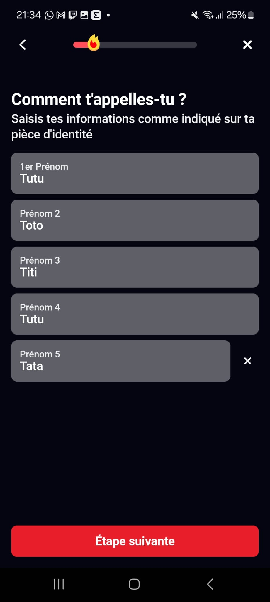
* Text area with firstname instructions
* a text field for the firstname
* a button "Ajouter un prénom" which displays an other field (possibility to add 5 firstnames in total)
* close button which allow the user to delete a firstname
* "Etape suivante" button
* a progression bar

## LastName page
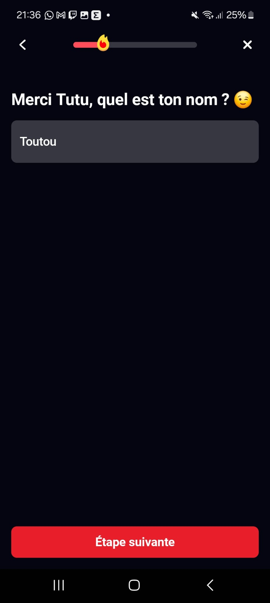
* a return button
* a progression bar
* a close button
* a text field for the lastname
* "Etape suivante" button

## Date of birth page

## Birth place page
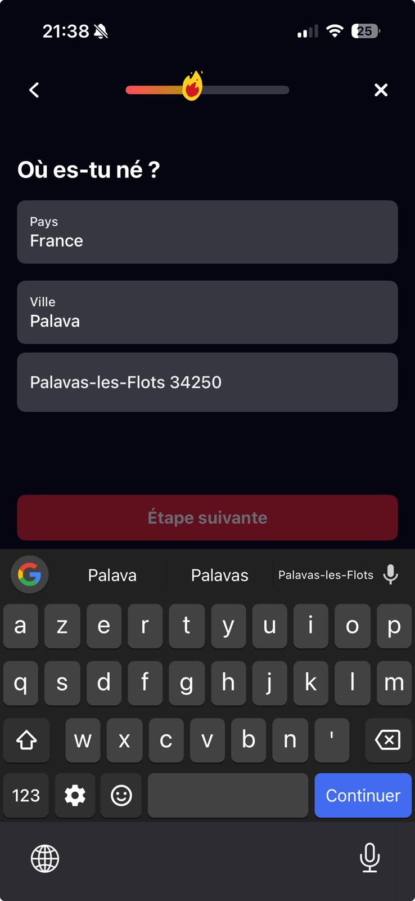
* a return button
* a progression bar
* a close button
* a pre-filled field "Pays" with "France" value, it's a autocompletion field
* an autocompletion field city
* "Etape suivante" button

## Proof of identity page
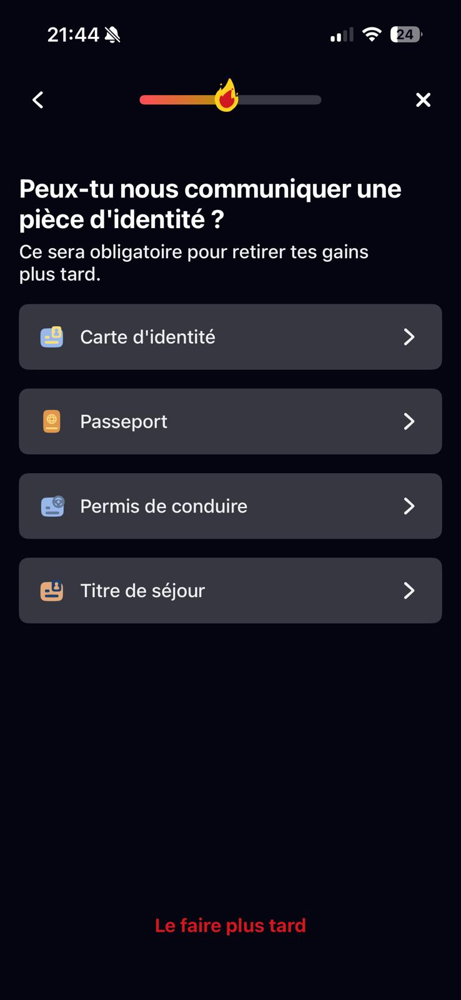
* a return button
* a progression bar
* a close button
* 4 buttons for each type of identity document
* "Le faire plus tard" button

## Pseudo choice page
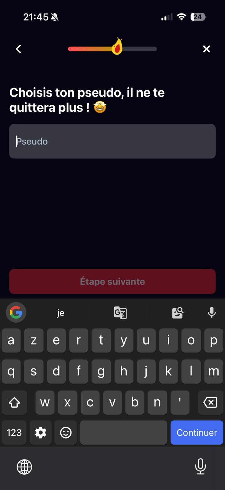
* a return button
* a progression bar
* a close button
* a pseudo field
* "Etape suivante" button

## Password page
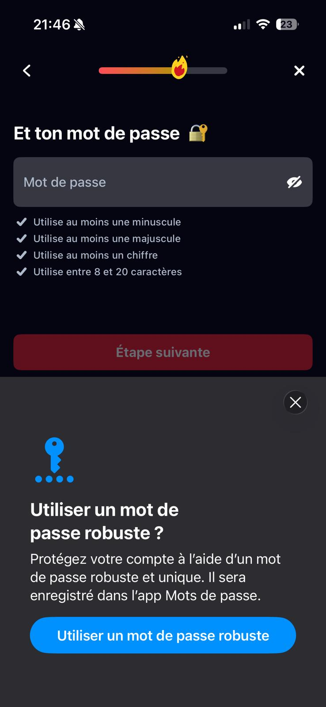
* a return button
* a progression bar
* a close button
* a password field
* 4 password requirements
* "Etape suivante" button

## Mail address page
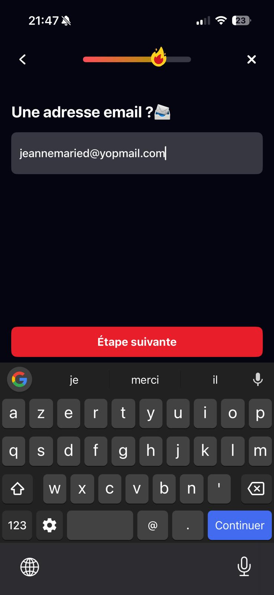
* a return button
* a progression bar
* a close button
* a mail address field
* "Etape suivante" button

## Mobile phone page
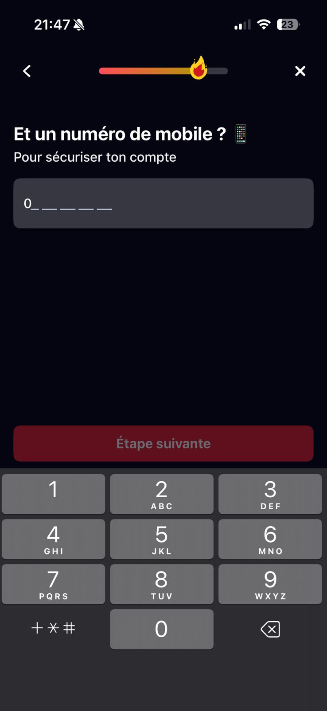
* a return button
* a progression bar
* a close button
* a phone numer field
* "Etape suivante" button

## Address page
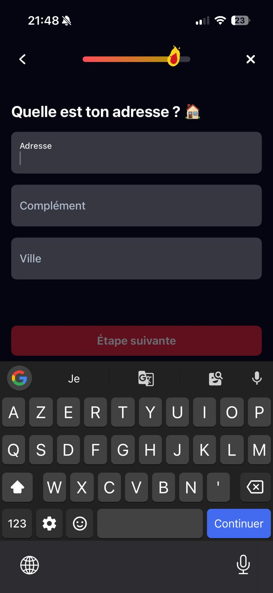
* a return button
* a progression bar
* a close button
* an address field
* a complement address field
* a city field
* "Etape suivante" button

## Proof of address page
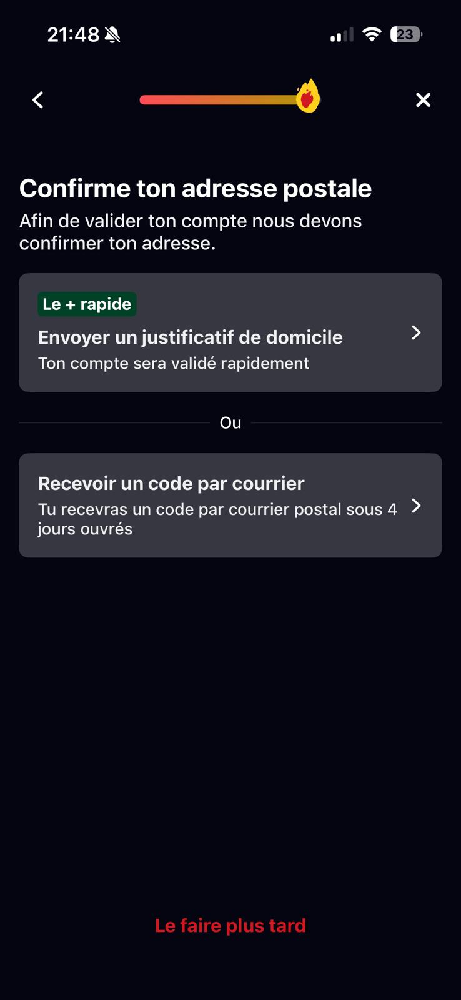
* a return button
* a progression bar
* a close button
* 2 choice button to prove your address
* "Le faire plus tard" button

## Term and conditions acceptance page
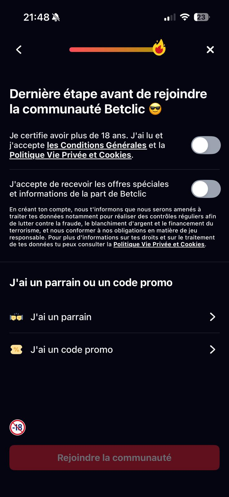
* a return button
* a progression bar
* a close button
* 2 toggle buttons
* a coupon button
* a sponsorship button
* "Rejoindre la communauté" button

## Success inscription page
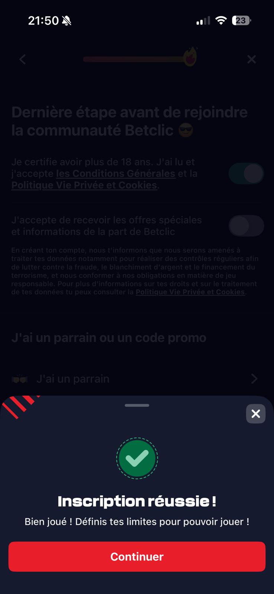
* a close button
* a continue button
* a success message

## Authentification page
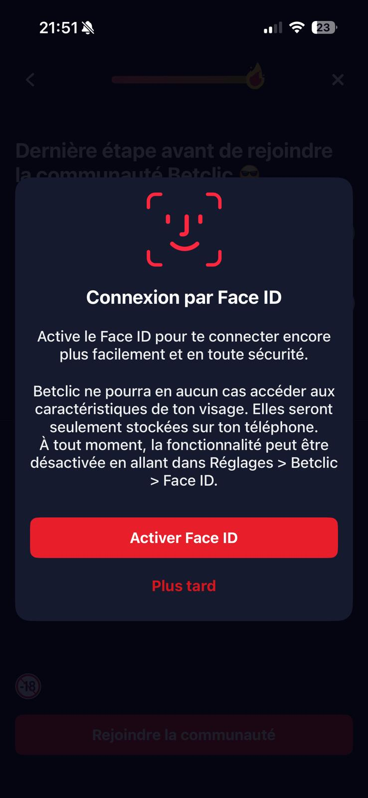
* an authentification text block
* a biometrics activation button
* "Plus tard" button

## Bettor profile page
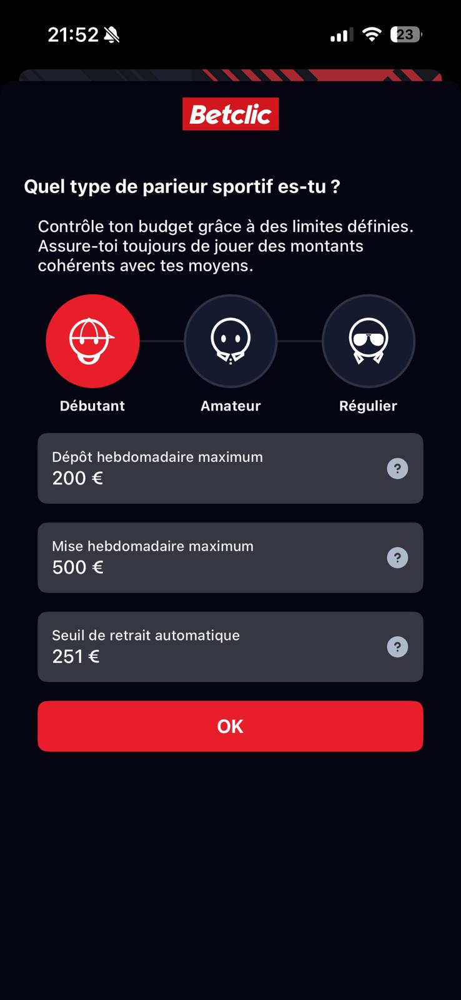
* 3 type bettor profile buttons
* 3 field limitations
* "Ok" button

---> Error message at this step (maybe because I used a yopmail address)

## Alternative branches
* Connexion even if it's the first time you download the app

* Quit the flow at the title page

* "Plus tard" buttons at pages Authentification page, Proof of address page, Proof of identity page

## edge cases worth testing 
* Enter a date of birth after 2008 --> not possible for minor people : 

* Enter a non valid mobile phone number --> important because mandatory to secure the account : 

# 2. UI/UX observations

# On iphone mobile (iPhone 15 pro, iOS 26.2), the "Etape suivante" button text is not displayed 

* Steps to reproduce : 
    * enter 2 differents firstnames
    * click on "Etape suivante" button
    * click on return button
* Observed result : 
    * the text of "Etape suivante" button is not displayed : 
    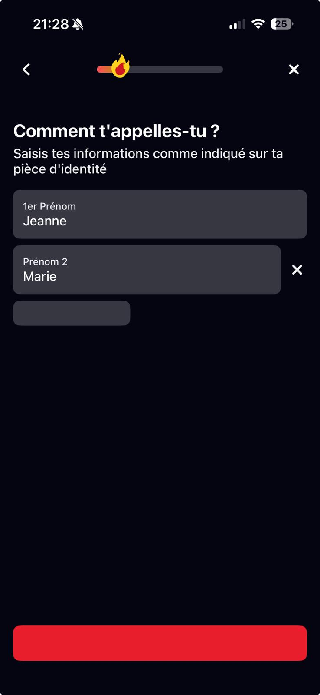

--> Low severity, because the button is displayed, without text, and the user is not blocked

# On iphone mobile (iPhone 15 pro, iOS 26.2), the "Ajouter un prénom" button text is not displayed 

* Steps to reproduce : 
    * enter 2 differents firstnames
    * click on "Etape suivante" button
    * click on return button
* Observed result : 
    * the text of "Ajouter un prénom" button is not displayed : 
    

--> Low severity, because the button is displayed, without text, and the user is not blocked

# On android mobile (Samsung A52s 5G, Android 14), impossible to add Toulouse 31000 in Birth city

* Steps to reproduce : 
    * enter the value "Toulouse 31000" in birth city field
* Observed result : 
    * the value is invalid : 
    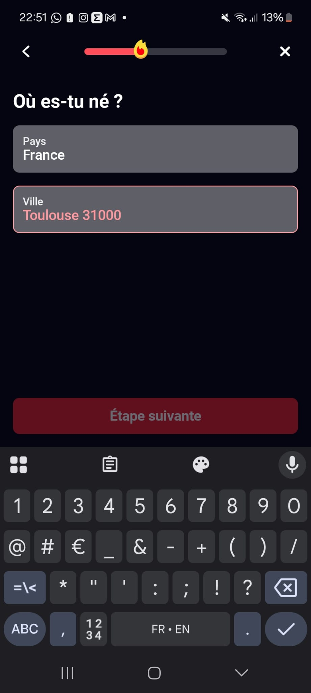

--> High severity because this could cause identity validation issues if the user's documents indicate that they were born in Toulouse 31000. 

# On iphone mobile (iPhone 15 pro, iOS 26.2), an error message is displayed when I use an existing or invalid email but without cause error 

* Steps to reproduce : 
    * fill all page
    * validate the last step (bettor profil)
    * click on "Ok" button
* Observed result : 
    * a message error is displayed : 
    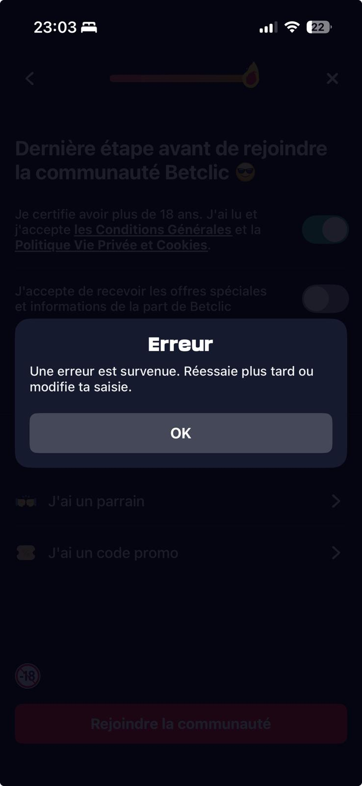

--> High severity, because the user should have an error cause to understand why his inscription is not possible (maybe an invalid email, or an invalid proof document)

# On iphone mobile (iPhone 15 pro, iOS 26.2), the "Etape suivante" button text is not displayed on lastame page

* Steps to reproduce : 
    * enter lastname
    * click on "Etape suivante" button
    * click on return button
* Observed result : 
    * the text of "Etape suivante" button is not displayed : 
    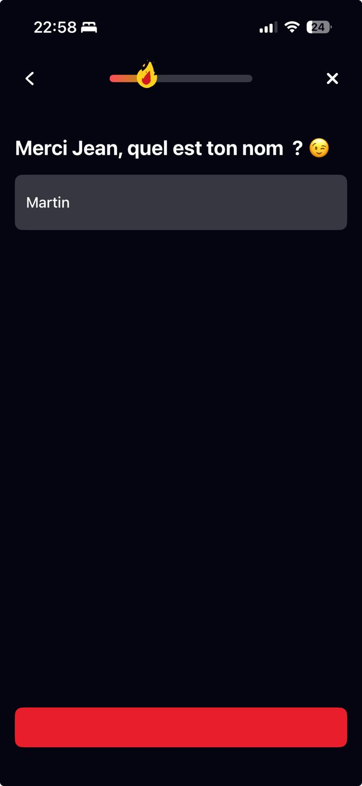

--> Low severity, because the button is displayed, without text, and the user is not blocked

